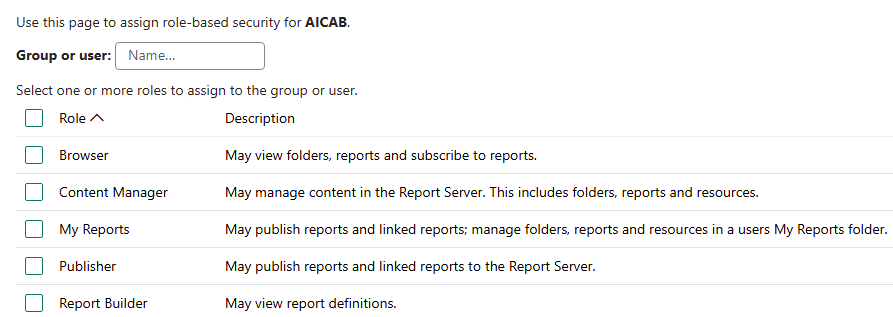

# User Guide

In this User Guide, I will be going over all the CSVs that will be used to house your configuration input data for the program.

They can be found in `/data/csv`. Generally, these CSVs are the only files you will have to open and edit to utilize the entire program.

### Project Dashboard

First, we need to fill up `dashboards.csv`. Each row (exlcuding the header) represents 1 dashboard.

There is only 1 field:

`Configure`: Project dashboard on PowerBI server that you want to add users to for row-level security + security.

### Row Level Security Data

Next, `row_level_security_data.csv`. Each row (excluding the header) represents 1 user.

There are 2 fields:

`email`: Email address of the user to be added to Row Level Security. A reminder that only existing JTC emails can be added.

`roles`: All roles to assign the user for Row Level Security. Multiple roles can be assigned per user by indicating multiple roles in this field, separated by commas with no whitespace. To see
what roles can be assigned for the current project's Row Level Security, please check the PowerBI site itself.

### Security Data

Next, `security_data.csv`. Each row (excluding the header) represents 1 user.

There are 2 fields:

`email`: Email address of the user to be added to Security. A reminder that only existing JTC emails can be added.

`roles`: All roles to assign the user for Security. Multiple roles can be assigned per user by indicating multiple roles in this field, separated by commas with no whitespace. To see
what roles can be assigned for the current project's Security, please check the PowerBI site itself.

### Security Roles Legend

Finally, `security_roles_legend.csv`. 

You may have noticed that when adding users to Security manually on the PowerBI site, there is an additional column titled "Description" when the full list of assignable roles for the new
user is shown.

Example for the AICAB project dashboard:

Essentially, `security_roles_legend.csv` is to be a copy of the table shown when attempting adding of users on PowerBI. The `role name` column should have all the assignable roles, and their
corresponding descriptions should be placed in the `role description` column.

# END
